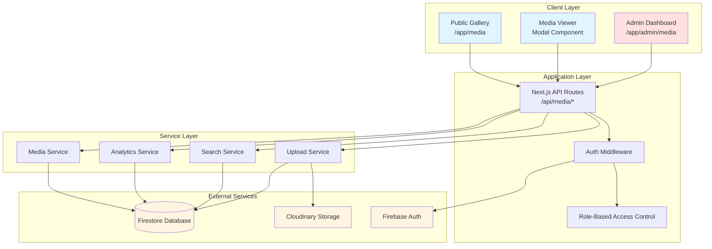

# Design Document: Media Library Management System

## Overview

The Media Library Management System is a comprehensive Next.js 15 application that provides church media content management and public browsing capabilities. The system integrates Firebase services (Firestore, Storage, Auth) with Cloudinary for media storage and transformations, delivering a performant, real-time media library experience across web and mobile devices.

### Key Design Goals

1. **Performance**: Fast loading times through pagination, caching, and CDN delivery
2. **Real-time Synchronization**: Instant updates using Firestore listeners
3. **Scalability**: Efficient queries and indexing to support growing media libraries
4. **Security**: Role-based access control integrated with existing auth system
5. **User Experience**: Responsive design with dark mode support and intuitive interfaces
6. **Media Quality**: Cloudinary integration for optimized delivery and transformations

### System Boundaries

**In Scope:**
- Public media gallery with search, filtering, and pagination
- Media viewer with appropriate players (image lightbox, video/audio players)
- Admin dashboard for media management and analytics
- Bulk upload with drag-and-drop interface
- Metadata management and organization (categories, tags, albums)
- Approval workflow for member submissions
- Role-based access control (admin, media_team, member, public)
- Media analytics tracking (views, downloads, shares)
- Real-time updates using Firestore
- Cloudinary integration for storage and transformations
- Mobile responsiveness and dark mode support

**Out of Scope:**
- Video/audio editing capabilities
- Live streaming functionality
- User comments or ratings on media
- Social media platform integrations beyond basic sharing
- Advanced analytics (demographics, engagement time)
- Media transcoding (handled by Cloudinary)
- Email notification system (assumes existing notification service)

## Architecture

### High-Level Architecture



### Technology Stack

**Frontend:**
- Next.js 15 (App Router)
- React 19
- TypeScript
- Tailwind CSS
- shadcn/ui components
- React Query for data fetching and caching

**Backend:**
- Next.js API Routes
- Firebase Admin SDK
- Cloudinary Node.js SDK

**Data Storage:**
- Firestore (metadata, analytics, user data)
- Cloudinary (media files)

**Authentication:**
- Firebase Auth (existing system)
- Role-based access control

### Architectural Patterns

**1. Service Layer Pattern**
All business logic is encapsulated in service modules that can be used by both API routes and server components:
- `MediaService`: CRUD operations for media items
- `AnalyticsService`: Tracking and reporting
- `SearchService`: Query building and execution
- `UploadService`: File validation and Cloudinary integration

**2. Repository Pattern**
Data access is abstracted through repository classes:
- `MediaRepository`: Firestore operations for media metadata
- `AnalyticsRepository`: Firestore operations for analytics data
- `AlbumRepository`: Firestore operations for album data

**3. Real-time Observer Pattern**
Firestore listeners provide real-time updates to connected clients:
- Public gallery subscribes to approved media changes
- Admin dashboard subscribes to all media changes
- Analytics updates propagate in real-time

**4. Middleware Chain Pattern**
API routes use middleware for cross-cutting concerns:
- Authentication verification
- Role-based authorization
- Request validation
- Error handling
- Logging

## Components and Interfaces

### Frontend Components

#### Public Gallery Components

**MediaGallery** (`/app/media/page.tsx`)
- Main public-facing page component
- Manages search, filter, and pagination state
- Subscribes to Firestore for real-time updates
- Renders MediaGrid with filtered results

**MediaGrid** (`/components/media/MediaGrid.tsx`)
- Responsive grid layout (1/2/3/4 columns based on breakpoint)
- Lazy loading for below-the-fold items
- Handles click events to open MediaViewer

**MediaCard** (`/components/media/MediaCard.tsx`)
- Displays thumbnail, title, category badge
- Shows metadata preview (date, views)
- Optimized Cloudinary image loading

**SearchBar** (`/components/media/SearchBar.tsx`)
- Text input with debounced search
- Real-time search suggestions
- Clear button

**FilterPanel** (`/components/media/FilterPanel.tsx`)
- Category filter (checkboxes)
- Date range picker
- Tag filter with autocomplete
- Active filters display with remove buttons

**MediaViewer** (`/components/media/MediaViewer.tsx`)
- Modal overlay component
- Renders appropriate player based on media type
- Displays full metadata
- Share and download actions
- Navigation to previous/next media in gallery

**ImageViewer** (`/components/media/viewers/ImageViewer.tsx`)
- Lightbox with zoom controls
- Pan and zoom gestures on mobile
- High-resolution image loading

**VideoPlayer** (`/components/media/viewers/VideoPlayer.tsx`)
- HTML5 video player with custom controls
- Play, pause, volume, fullscreen
- Progress bar with seek
- Playback speed control

**AudioPlayer** (`/components/media/viewers/AudioPlayer.tsx`)
- Audio player with waveform visualization
- Play, pause, volume controls
- Progress bar with seek
- Playlist support for albums

#### Admin Dashboard Components

**AdminMediaDashboard** (`/app/admin/media/page.tsx`)
- Main admin interface
- Tabs for: All Media, Pending Approval, Analytics
- Bulk action toolbar
- Infinite scroll media list

**MediaUploader** (`/components/admin/MediaUploader.tsx`)
- Drag-and-drop zone
- File selection button
- Upload progress indicators
- Bulk upload support (up to 50 files)
- Error handling and retry

**MediaEditor** (`/components/admin/MediaEditor.tsx`)
- Form for editing metadata
- Title, description, category, tags, date
- Album assignment
- Save and cancel actions
- Real-time validation

**ApprovalQueue** (`/components/admin/ApprovalQueue.tsx`)
- List of pending media items
- Preview thumbnails
- Approve/reject buttons
- Rejection reason input
- Batch approval support

**MediaAnalytics** (`/components/admin/MediaAnalytics.tsx`)
- Dashboard with key metrics
- Top 10 most viewed media (last 30 days)
- Charts for views, downloads, shares over time
- Per-media analytics detail view

**AlbumManager** (`/components/admin/AlbumManager.tsx`)
- Create/edit/delete albums
- Drag-and-drop media into albums
- Album preview and reordering

### API Routes

**Media CRUD Operations**

`GET /api/media`
- Query parameters: category, tags, search, page, limit, dateFrom, dateTo
- Returns: Paginated media items with metadata
- Access: Public (approved items only), Admin (all items)

`GET /api/media/[id]`
- Returns: Single media item with full metadata
- Access: Public (if approved), Admin (all)

`POST /api/media`
- Body: File upload (multipart/form-data) + metadata
- Returns: Created media item with Cloudinary URLs
- Access: member, media_team, admin

`PATCH /api/media/[id]`
- Body: Updated metadata fields
- Returns: Updated media item
- Access: media_team, admin

`DELETE /api/media/[id]`
- Returns: Success confirmation
- Access: admin only

`POST /api/media/bulk-delete`
- Body: Array of media IDs
- Returns: Deletion results
- Access: admin only

**Upload Operations**

`POST /api/media/upload`
- Body: File (multipart/form-data)
- Returns: Cloudinary upload result
- Access: member, media_team, admin
- Validates file type and size
- Uploads to Cloudinary
- Creates Firestore metadata record

`POST /api/media/bulk-upload`
- Body: Multiple files (multipart/form-data)
- Returns: Array of upload results
- Access: media_team, admin
- Processes up to 50 files
- Parallel uploads with progress tracking

**Approval Operations**

`PATCH /api/media/[id]/approve`
- Returns: Updated media item with approved status
- Access: admin only
- Triggers notification to uploader

`PATCH /api/media/[id]/reject`
- Body: Rejection reason (optional)
- Returns: Updated media item with rejected status
- Access: admin only
- Triggers notification to uploader

`GET /api/media/pending`
- Returns: List of media items pending approval
- Access: admin only

**Album Operations**

`GET /api/albums`
- Returns: List of all albums
- Access: Public

`GET /api/albums/[id]`
- Returns: Album with associated media items
- Access: Public

`POST /api/albums`
- Body: Album name, description
- Returns: Created album
- Access: media_team, admin

`PATCH /api/albums/[id]`
- Body: Updated album fields
- Returns: Updated album
- Access: media_team, admin

`POST /api/albums/[id]/media`
- Body: Array of media IDs to add
- Returns: Updated album
- Access: media_team, admin

`DELETE /api/albums/[id]/media/[mediaId]`
- Returns: Updated album
- Access: media_team, admin

**Analytics Operations**

`POST /api/analytics/view`
- Body: Media ID
- Returns: Success confirmation
- Access: Public
- Increments view count

`POST /api/analytics/download`
- Body: Media ID
- Returns: Success confirmation
- Access: Public
- Increments download count

`POST /api/analytics/share`
- Body: Media ID
- Returns: Success confirmation
- Access: Public
- Increments share count

`GET /api/analytics/media/[id]`
- Returns: Analytics data for specific media
- Access: admin only

`GET /api/analytics/dashboard`
- Query parameters: dateFrom, dateTo
- Returns: Aggregated analytics (top media, trends)
- Access: admin only

**Search Operations**

`GET /api/search`
- Query parameters: q (query), category, tags, dateFrom, dateTo, page, limit
- Returns: Paginated search results
- Access: Public (approved items only), Admin (all items)
- Implements full-text search across title, description, tags

### Service Interfaces

**MediaService**

```typescript
interface MediaService {
  // Create
  createMedia(data: CreateMediaInput, uploaderId: string): Promise<MediaItem>;
  
  // Read
  getMediaById(id: string, userId?: string): Promise<MediaItem | null>;
  getMediaList(filters: MediaFilters, userId?: string): Promise<PaginatedMediaResult>;
  getMediaByAlbum(albumId: string): Promise<MediaItem[]>;
  
  // Update
  updateMedia(id: string, data: UpdateMediaInput, userId: string): Promise<MediaItem>;
  approveMedia(id: string, approverId: string): Promise<MediaItem>;
  rejectMedia(id: string, approverId: string, reason?: string): Promise<MediaItem>;
  archiveMedia(id: string, userId: string): Promise<MediaItem>;
  
  // Delete
  deleteMedia(id: string, userId: string): Promise<void>;
  bulkDeleteMedia(ids: string[], userId: string): Promise<BulkDeleteResult>;
  
  // Real-time
  subscribeToMediaChanges(filters: MediaFilters, callback: (media: MediaItem[]) => void): Unsubscribe;
}
```

**UploadService**

```typescript
interface UploadService {
  // Validation
  validateFile(file: File): ValidationResult;
  extractMetadata(file: File): Promise<FileMetadata>;
  
  // Upload
  uploadToCloudinary(file: File, options: UploadOptions): Promise<CloudinaryResult>;
  uploadBulk(files: File[], options: UploadOptions): Promise<CloudinaryResult[]>;
  
  // Retry
  retryUpload(file: File, options: UploadOptions, maxRetries: number): Promise<CloudinaryResult>;
}
```

**SearchService**

```typescript
interface SearchService {
  // Search
  searchMedia(query: string, filters: SearchFilters): Promise<PaginatedMediaResult>;
  
  // Indexing
  indexMedia(media: MediaItem): Promise<void>;
  updateIndex(mediaId: string, updates: Partial<MediaItem>): Promise<void>;
  
  // Suggestions
  getSuggestions(query: string, limit: number): Promise<string[]>;
  getPopularTags(limit: number): Promise<Tag[]>;
}
```

**AnalyticsService**

```typescript
interface AnalyticsService {
  // Tracking
  trackView(mediaId: string, userId?: string): Promise<void>;
  trackDownload(mediaId: string, userId?: string): Promise<void>;
  trackShare(mediaId: string, platform: string, userId?: string): Promise<void>;
  
  // Reporting
  getMediaAnalytics(mediaId: string): Promise<MediaAnalytics>;
  getTopMedia(limit: number, dateRange: DateRange): Promise<MediaAnalytics[]>;
  getDashboardMetrics(dateRange: DateRange): Promise<DashboardMetrics>;
  
  // Real-time
  subscribeToAnalytics(mediaId: string, callback: (analytics: MediaAnalytics) => void): Unsubscribe;
}
```

## Data Models

### Firestore Collections

**media_items** Collection

```typescript
interface MediaItem {
  id: string;                          // Firestore document ID
  title: string;                       // 3-200 characters
  description: string;                 // 0-2000 characters
  category: MediaCategory;             // sermons | events | photos | videos | audio | documents
  tags: string[];                      // Array of tag strings
  
  // Cloudinary data
  cloudinaryPublicId: string;          // Cloudinary public_id
  cloudinarySecureUrl: string;         // Cloudinary secure_url
  thumbnailUrl: string;                // 400x300 thumbnail
  mediumUrl?: string;                  // 800x600 (images only)
  largeUrl?: string;                   // 1200x900 (images only)
  
  // File metadata
  fileType: FileType;                  // image | video | audio | document
  mimeType: string;                    // e.g., image/jpeg, video/mp4
  fileSize: number;                    // Bytes
  dimensions?: {                       // For images and videos
    width: number;
    height: number;
  };
  duration?: number;                   // Seconds (for video/audio)
  pageCount?: number;                  // For documents
  
  // Approval workflow
  approvalStatus: ApprovalStatus;      // pending | approved | rejected | archived
  rejectionReason?: string;
  
  // User tracking
  uploaderId: string;                  // User ID who uploaded
  uploaderName: string;                // Display name
  approverId?: string;                 // User ID who approved/rejected
  approverName?: string;               // Display name
  
  // Timestamps
  uploadedAt: Timestamp;               // Upload time
  approvedAt?: Timestamp;              // Approval time
  updatedAt: Timestamp;                // Last update time
  
  // Search optimization
  titleLower: string;                  // Lowercase title for search
  descriptionLower: string;            // Lowercase description for search
  tagsLower: string[];                 // Lowercase tags for search
  searchText: string;                  // Combined search field
  
  // Organization
  albumIds: string[];                  // Array of album IDs this media belongs to
}

type MediaCategory = 'sermons' | 'events' | 'photos' | 'videos' | 'audio' | 'documents';
type FileType = 'image' | 'video' | 'audio' | 'document';
type ApprovalStatus = 'pending' | 'approved' | 'rejected' | 'archived';
```

**albums** Collection

```typescript
interface Album {
  id: string;                          // Firestore document ID
  name: string;                        // Album name
  description: string;                 // Album description
  coverMediaId?: string;               // ID of media item to use as cover
  mediaIds: string[];                  // Ordered array of media IDs
  createdBy: string;                   // User ID
  createdAt: Timestamp;
  updatedAt: Timestamp;
}
```

**media_analytics** Collection

```typescript
interface MediaAnalytics {
  id: string;                          // Same as media item ID
  mediaId: string;                     // Reference to media item
  
  // Counters
  viewCount: number;
  downloadCount: number;
  shareCount: number;
  
  // Detailed tracking (subcollections)
  // views: Collection of view events
  // downloads: Collection of download events
  // shares: Collection of share events
  
  // Timestamps
  lastViewedAt?: Timestamp;
  lastDownloadedAt?: Timestamp;
  lastSharedAt?: Timestamp;
  updatedAt: Timestamp;
}
```

**media_analytics/{id}/views** Subcollection

```typescript
interface ViewEvent {
  id: string;                          // Auto-generated
  userId?: string;                     // User ID (if authenticated)
  timestamp: Timestamp;
  sessionId: string;                   // Browser session ID
}
```

**media_analytics/{id}/downloads** Subcollection

```typescript
interface DownloadEvent {
  id: string;                          // Auto-generated
  userId?: string;                     // User ID (if authenticated)
  timestamp: Timestamp;
}
```

**media_analytics/{id}/shares** Subcollection

```typescript
interface ShareEvent {
  id: string;                          // Auto-generated
  userId?: string;                     // User ID (if authenticated)
  platform: string;                    // facebook | twitter | email | link
  timestamp: Timestamp;
}
```

### Firestore Indexes

Required composite indexes for efficient queries:

1. **Media List Query**
   - Collection: `media_items`
   - Fields: `approvalStatus` (ASC), `uploadedAt` (DESC)

2. **Category Filter**
   - Collection: `media_items`
   - Fields: `approvalStatus` (ASC), `category` (ASC), `uploadedAt` (DESC)

3. **Search with Category**
   - Collection: `media_items`
   - Fields: `approvalStatus` (ASC), `category` (ASC), `searchText` (ASC), `uploadedAt` (DESC)

4. **Date Range Query**
   - Collection: `media_items`
   - Fields: `approvalStatus` (ASC), `uploadedAt` (ASC), `uploadedAt` (DESC)

5. **Album Media Query**
   - Collection: `media_items`
   - Fields: `albumIds` (ARRAY_CONTAINS), `approvalStatus` (ASC), `uploadedAt` (DESC)

6. **Pending Approval Queue**
   - Collection: `media_items`
   - Fields: `approvalStatus` (ASC), `uploadedAt` (ASC)

### TypeScript Type Definitions

**Input Types**

```typescript
interface CreateMediaInput {
  title: string;
  description: string;
  category: MediaCategory;
  tags: string[];
  file: File;
}

interface UpdateMediaInput {
  title?: string;
  description?: string;
  category?: MediaCategory;
  tags?: string[];
  albumIds?: string[];
}

interface MediaFilters {
  category?: MediaCategory;
  tags?: string[];
  dateFrom?: Date;
  dateTo?: Date;
  approvalStatus?: ApprovalStatus;
  uploaderId?: string;
  albumId?: string;
  page?: number;
  limit?: number;
}

interface SearchFilters extends MediaFilters {
  query: string;
}
```

**Response Types**

```typescript
interface PaginatedMediaResult {
  items: MediaItem[];
  total: number;
  page: number;
  limit: number;
  hasMore: boolean;
}

interface CloudinaryResult {
  publicId: string;
  secureUrl: string;
  thumbnailUrl: string;
  mediumUrl?: string;
  largeUrl?: string;
  width?: number;
  height?: number;
  duration?: number;
  format: string;
  bytes: number;
}

interface ValidationResult {
  valid: boolean;
  errors: string[];
}

interface BulkDeleteResult {
  successful: string[];
  failed: Array<{
    id: string;
    error: string;
  }>;
}

interface DashboardMetrics {
  totalMedia: number;
  totalViews: number;
  totalDownloads: number;
  totalShares: number;
  topMedia: MediaAnalytics[];
  viewsTrend: TrendData[];
  downloadsTrend: TrendData[];
  sharesTrend: TrendData[];
}

interface TrendData {
  date: string;
  count: number;
}
```

### Cloudinary Configuration

**Upload Presets**

```typescript
const CLOUDINARY_CONFIG = {
  cloudName: process.env.NEXT_PUBLIC_CLOUDINARY_CLOUD_NAME,
  uploadPreset: 'media_library',
  
  // Folder structure
  folders: {
    images: 'media-library/images',
    videos: 'media-library/videos',
    audio: 'media-library/audio',
    documents: 'media-library/documents',
  },
  
  // Transformation presets
  transformations: {
    thumbnail: { width: 400, height: 300, crop: 'fill', quality: 'auto', fetch_format: 'auto' },
    medium: { width: 800, height: 600, crop: 'limit', quality: 'auto', fetch_format: 'auto' },
    large: { width: 1200, height: 900, crop: 'limit', quality: 'auto', fetch_format: 'auto' },
    videoThumbnail: { width: 400, height: 300, crop: 'fill', quality: 'auto', format: 'jpg' },
  },
  
  // File size limits (bytes)
  maxFileSizes: {
    image: 100 * 1024 * 1024,    // 100MB
    video: 500 * 1024 * 1024,    // 500MB
    audio: 50 * 1024 * 1024,     // 50MB
    document: 25 * 1024 * 1024,  // 25MB
  },
  
  // Accepted formats
  acceptedFormats: {
    image: ['jpg', 'jpeg', 'png', 'webp'],
    video: ['mp4', 'mov'],
    audio: ['mp3', 'wav'],
    document: ['pdf'],
  },
};
```


## Correctness Properties

*A property is a characteristic or behavior that should hold true across all valid executions of a system—essentially, a formal statement about what the system should do. Properties serve as the bridge between human-readable specifications and machine-verifiable correctness guarantees.*

### Property Reflection

After analyzing all acceptance criteria, I identified the following redundancies:
- Properties 1.3 and 3.1 both test search across title, description, and tags (combined into Property 1)
- Properties 2.7 and 10.2 both test view count incrementing (combined into Property 8)
- Properties 1.4 and 12.1 both test pagination size of 24 items (combined into Property 2)
- Properties 8.6 and 17.4 both test unauthorized access handling (combined into Property 15)
- Properties 1.7, 18.2, 18.3, 18.4 all test dark mode styling application (combined into examples, not properties)
- Properties 4.7 and 15.2-15.5 overlap on file format validation (consolidated into Property 23)
- Properties 13.1 and 13.2 can be combined into a single upload persistence property (Property 20)

### Property 1: Search Query Matching

*For any* search query and any set of media items, the search results SHALL only include media items where the query text appears as a substring (case-insensitive) in the title, description, or tags fields.

**Validates: Requirements 1.3, 3.1, 3.6**

### Property 2: Pagination Size Constraint

*For any* page of media results (except the last page), the system SHALL return exactly 24 media items per page. For the last page, the system SHALL return the remaining items (1-24).

**Validates: Requirements 1.4, 12.1**

### Property 3: Category Filter Exclusivity

*For any* selected category filter and any set of media items, applying the category filter SHALL return only media items where the category field exactly matches the selected category.

**Validates: Requirements 1.2**

### Property 4: Multiple Filter Conjunction

*For any* combination of filters (category, tags, date range), the system SHALL return only media items that satisfy ALL applied filter criteria (AND logic, not OR).

**Validates: Requirements 3.3**

### Property 5: Media Viewer Metadata Display

*For any* media item opened in the viewer, the viewer SHALL display all required metadata fields: title, description, upload date, and tags.

**Validates: Requirements 2.5**

### Property 6: File Size Validation Limits

*For any* uploaded file, the validation SHALL reject files exceeding the type-specific size limits: 100MB for images, 500MB for videos, 50MB for audio, 25MB for documents.

**Validates: Requirements 4.8**

### Property 7: Bulk Upload Capacity Constraint

*For any* bulk upload operation, the system SHALL accept up to 50 files and SHALL reject bulk upload requests containing more than 50 files.

**Validates: Requirements 4.2**

### Property 8: View Count Increment

*For any* media item, when a user views that media item, the system SHALL increment the view count in analytics by exactly 1.

**Validates: Requirements 2.7, 10.2**

### Property 9: Download Count Increment

*For any* media item, when a user downloads that media item, the system SHALL increment the download count in analytics by exactly 1.

**Validates: Requirements 10.3**

### Property 10: Share Count Increment

*For any* media item, when a user shares that media item, the system SHALL increment the share count in analytics by exactly 1.

**Validates: Requirements 10.4**

### Property 11: Upload Metadata Persistence

*For any* successful file upload, the system SHALL store media metadata in Firestore including all required fields: title, description, category, tags, cloudinaryPublicId, cloudinarySecureUrl, uploaderId, uploaderName, uploadedAt, and approvalStatus.

**Validates: Requirements 4.4**

### Property 12: Title Validation Constraints

*For any* media item metadata, the title validation SHALL reject titles that are empty, less than 3 characters, or greater than 200 characters.

**Validates: Requirements 5.4**

### Property 13: Description Length Validation

*For any* media item metadata, the description validation SHALL reject descriptions longer than 2000 characters.

**Validates: Requirements 5.5**

### Property 14: Metadata Update Audit Trail

*For any* metadata update operation, the system SHALL record both the update timestamp (updatedAt) and the updating user's ID in the media item record.

**Validates: Requirements 5.7**

### Property 15: Unauthorized Access Denial

*For any* user attempting to access a feature without sufficient role permissions, the system SHALL deny access and return an "access denied" error response.

**Validates: Requirements 8.6, 17.4**

### Property 16: Category Enumeration Constraint

*For any* media item, the category field SHALL only accept values from the enumerated set: sermons, events, photos, videos, audio, documents. Any other value SHALL be rejected.

**Validates: Requirements 6.1**

### Property 17: Album Creation Persistence

*For any* album creation request with valid name and description, the system SHALL store the album in Firestore with all required fields: id, name, description, mediaIds (empty array), createdBy, createdAt, updatedAt.

**Validates: Requirements 6.3**

### Property 18: Multi-Album Membership

*For any* media item, the system SHALL allow that media item to be added to multiple albums simultaneously, with the media item's albumIds array containing all album IDs it belongs to.

**Validates: Requirements 6.5**

### Property 19: Album Content Retrieval

*For any* album, when a user opens that album, the system SHALL return all media items whose albumIds array contains that album's ID.

**Validates: Requirements 6.7**

### Property 20: Member Upload Pending Status

*For any* media item uploaded by a user with role "member", the system SHALL automatically set the approvalStatus field to "pending".

**Validates: Requirements 7.1**

### Property 21: Admin Approval Status Transition

*For any* media item with approvalStatus "pending", when an admin approves it, the system SHALL set approvalStatus to "approved" and make the item visible in queries filtered by approved status.

**Validates: Requirements 7.4**

### Property 22: Admin Rejection Status Transition

*For any* media item with approvalStatus "pending", when an admin rejects it, the system SHALL set approvalStatus to "rejected" and optionally store the rejection reason if provided.

**Validates: Requirements 7.5**

### Property 23: Approval Notification Trigger

*For any* media item that transitions from "pending" to "approved" or "rejected", the system SHALL trigger a notification to the uploader (user ID in uploaderId field).

**Validates: Requirements 7.6**

### Property 24: Privileged User Auto-Approval

*For any* media item uploaded by a user with role "admin" or "media_team", the system SHALL automatically set the approvalStatus field to "approved".

**Validates: Requirements 7.7**

### Property 25: Public User Access Restriction

*For any* user with role "public", the system SHALL only return media items where approvalStatus equals "approved" in all query results.

**Validates: Requirements 8.2**

### Property 26: Member Submission Permission

*For any* user with role "member", the system SHALL allow media upload operations and SHALL apply the approval workflow (setting status to "pending").

**Validates: Requirements 8.3**

### Property 27: Media Team Dashboard Access

*For any* user with role "media_team", the system SHALL allow access to admin dashboard features: upload, edit metadata, create albums, and add media to albums.

**Validates: Requirements 8.4**

### Property 28: Admin Full Access

*For any* user with role "admin", the system SHALL allow access to all admin dashboard features including: upload, edit, delete, approve, reject, archive, and analytics.

**Validates: Requirements 8.5**

### Property 29: Client and Server Role Verification

*For any* protected operation, the system SHALL verify the user's role on both the client side (for UI rendering) and server side (for authorization enforcement).

**Validates: Requirements 8.7**

### Property 30: Metadata Deletion on Media Delete

*For any* media item deletion operation, the system SHALL remove the media metadata document from Firestore.

**Validates: Requirements 9.2**

### Property 31: Cloudinary File Deletion on Media Delete

*For any* media item deletion operation, the system SHALL delete the associated file from Cloudinary using the stored cloudinaryPublicId.

**Validates: Requirements 9.3**

### Property 32: Archive Status Visibility

*For any* media item with approvalStatus "archived", the system SHALL exclude it from public gallery queries but SHALL include it in admin dashboard queries.

**Validates: Requirements 9.5**

### Property 33: Bulk Deletion Capacity

*For any* bulk deletion operation, the system SHALL accept up to 100 media item IDs and SHALL process deletion for all provided IDs.

**Validates: Requirements 9.6**

### Property 34: Admin Deletion Permission

*For any* deletion or archival operation, the system SHALL only allow execution if the requesting user has role "admin".

**Validates: Requirements 9.7**

### Property 35: Top Media Ranking

*For any* analytics dashboard query for top media in a date range, the system SHALL return media items ordered by view count in descending order, limited to the top 10 items.

**Validates: Requirements 10.6**

### Property 36: Real-Time Approval Update

*For any* media item that transitions to "approved" status, the public gallery SHALL automatically display the new item without requiring a page refresh (via Firestore listener).

**Validates: Requirements 11.2**

### Property 37: Admin Dashboard Real-Time Sync

*For any* media metadata update, the admin dashboard SHALL reflect the changes automatically without requiring a page refresh (via Firestore listener).

**Validates: Requirements 11.4**

### Property 38: Cloudinary Thumbnail Transformation

*For any* image media item, the system SHALL generate a Cloudinary thumbnail URL with transformation parameters: width=400, height=300, crop=fill, quality=auto, fetch_format=auto.

**Validates: Requirements 12.4**

### Property 39: Metadata Query Caching

*For any* media metadata query, if the same query is executed within 5 minutes, the system SHALL return cached results instead of querying Firestore again.

**Validates: Requirements 12.6**

### Property 40: Cloudinary Upload Persistence

*For any* successful media upload, the system SHALL store both the Cloudinary public_id and secure_url in the media metadata record.

**Validates: Requirements 13.1, 13.2**

### Property 41: Image Thumbnail Generation

*For any* image upload, the system SHALL generate Cloudinary transformation URLs for three thumbnail sizes: 400x300, 800x600, and 1200x900.

**Validates: Requirements 13.3**

### Property 42: Video Thumbnail Generation

*For any* video upload, the system SHALL generate a Cloudinary video thumbnail transformation URL for preview display.

**Validates: Requirements 13.4**

### Property 43: Cloudinary CDN URL Usage

*For any* media item served to clients, the system SHALL use Cloudinary CDN URLs (containing cloudinary.com domain) for all media file references.

**Validates: Requirements 13.5**

### Property 44: Cloudinary Upload Retry Logic

*For any* failed Cloudinary upload, the system SHALL retry the upload operation up to 3 times before reporting a final failure to the user.

**Validates: Requirements 13.7**

### Property 45: File Header Validation

*For any* uploaded file, the system SHALL parse the file header bytes to verify the actual file type matches the declared MIME type before accepting the upload.

**Validates: Requirements 15.1**

### Property 46: Image Format Validation

*For any* file uploaded as an image, the validation SHALL only accept files with format JPEG, PNG, or WebP, rejecting all other formats.

**Validates: Requirements 15.2**

### Property 47: Video Format Validation

*For any* file uploaded as a video, the validation SHALL only accept files with format MP4 or MOV with H.264 codec, rejecting all other formats.

**Validates: Requirements 15.3**

### Property 48: Audio Format Validation

*For any* file uploaded as audio, the validation SHALL only accept files with format MP3 or WAV, rejecting all other formats.

**Validates: Requirements 15.4**

### Property 49: Document Format Validation

*For any* file uploaded as a document, the validation SHALL only accept files with format PDF, rejecting all other formats.

**Validates: Requirements 15.5**

### Property 50: Validation Failure Error Response

*For any* file that fails validation, the system SHALL reject the upload and return an error response containing a descriptive message explaining the validation failure reason.

**Validates: Requirements 15.6**

### Property 51: File Metadata Extraction

*For any* valid uploaded file, the system SHALL extract and store type-specific metadata: dimensions (width, height) for images and videos, duration for videos and audio, page count for documents.

**Validates: Requirements 15.7, 15.8**

### Property 52: Search Index Maintenance

*For any* media metadata creation or update, the system SHALL update the search-optimized fields: titleLower, descriptionLower, tagsLower, and searchText (combined lowercase text).

**Validates: Requirements 16.1, 16.2**

### Property 53: Compound Query Support

*For any* query combining category filter, date range filter, and text search, the system SHALL execute the compound query successfully and return results matching all criteria.

**Validates: Requirements 16.5**

### Property 54: Search Result Relevance Ranking

*For any* search query, the system SHALL order results with title matches ranked higher than description matches, which are ranked higher than tag-only matches.

**Validates: Requirements 16.6**

### Property 55: Search Result Limit

*For any* search query, the system SHALL return a maximum of 1000 results, even if more matching media items exist.

**Validates: Requirements 16.7**

### Property 56: Upload Failure Error Message

*For any* failed file upload, the system SHALL display an error message that includes both the specific filename and the reason for the upload failure.

**Validates: Requirements 17.1**

### Property 57: Error Logging

*For any* error that occurs in the system, the error SHALL be logged to the centralized error tracking service with relevant context (user ID, operation, timestamp, error details).

**Validates: Requirements 17.7**

### Property 58: Dark Mode Preference Persistence

*For any* user dark mode preference change (via manual toggle), the system SHALL persist the preference to browser local storage and retrieve it on subsequent page loads.

**Validates: Requirements 18.6**


## Error Handling

### Error Categories

**1. Validation Errors**
- Invalid file format or size
- Invalid metadata (title length, description length)
- Invalid category or role values
- Malformed request data

**Response:** 400 Bad Request with descriptive error message
**User Feedback:** Inline form validation errors, toast notifications
**Logging:** Info level (expected user errors)

**2. Authentication Errors**
- Missing or invalid authentication token
- Expired session

**Response:** 401 Unauthorized
**User Feedback:** Redirect to login page with return URL
**Logging:** Warning level

**3. Authorization Errors**
- Insufficient permissions for requested operation
- Attempting to access another user's pending media

**Response:** 403 Forbidden with "access denied" message
**User Feedback:** Error modal with explanation, redirect to appropriate page
**Logging:** Warning level with user ID and attempted operation

**4. Resource Not Found Errors**
- Media item ID doesn't exist
- Album ID doesn't exist
- User ID doesn't exist

**Response:** 404 Not Found
**User Feedback:** "Content not found" message with navigation options
**Logging:** Info level

**5. External Service Errors**
- Cloudinary upload failure
- Cloudinary deletion failure
- Firestore connection loss
- Firestore operation timeout

**Response:** 503 Service Unavailable
**User Feedback:** Service-specific error message, retry option for uploads
**Retry Logic:** Automatic retry up to 3 times with exponential backoff
**Logging:** Error level with service name and error details

**6. Rate Limiting Errors**
- Too many upload requests
- Too many API calls

**Response:** 429 Too Many Requests
**User Feedback:** "Please wait before trying again" message
**Logging:** Warning level

**7. Server Errors**
- Unhandled exceptions
- Database constraint violations
- Memory errors

**Response:** 500 Internal Server Error
**User Feedback:** Generic "something went wrong" message with error ID for support
**Logging:** Error level with full stack trace

### Error Handling Patterns

**API Route Error Handler Middleware**

```typescript
export async function errorHandler(
  error: Error,
  req: NextRequest
): Promise<NextResponse> {
  // Log error with context
  await logError(error, {
    userId: req.user?.id,
    path: req.url,
    method: req.method,
    timestamp: new Date().toISOString(),
  });

  // Determine error type and response
  if (error instanceof ValidationError) {
    return NextResponse.json(
      { error: error.message, details: error.details },
      { status: 400 }
    );
  }

  if (error instanceof AuthenticationError) {
    return NextResponse.json(
      { error: 'Authentication required' },
      { status: 401 }
    );
  }

  if (error instanceof AuthorizationError) {
    return NextResponse.json(
      { error: 'Access denied' },
      { status: 403 }
    );
  }

  if (error instanceof NotFoundError) {
    return NextResponse.json(
      { error: 'Resource not found' },
      { status: 404 }
    );
  }

  if (error instanceof ExternalServiceError) {
    return NextResponse.json(
      { error: error.message, service: error.serviceName },
      { status: 503 }
    );
  }

  // Default: Internal server error
  const errorId = generateErrorId();
  return NextResponse.json(
    { error: 'An unexpected error occurred', errorId },
    { status: 500 }
  );
}
```

**Client-Side Error Boundary**

```typescript
export class MediaLibraryErrorBoundary extends React.Component {
  componentDidCatch(error: Error, errorInfo: React.ErrorInfo) {
    // Log to error tracking service
    logClientError(error, errorInfo);
    
    // Update state to show fallback UI
    this.setState({ hasError: true, error });
  }

  render() {
    if (this.state.hasError) {
      return <ErrorFallback error={this.state.error} />;
    }
    return this.props.children;
  }
}
```

**Upload Error Handling with Retry**

```typescript
async function uploadWithRetry(
  file: File,
  maxRetries: number = 3
): Promise<CloudinaryResult> {
  let lastError: Error;
  
  for (let attempt = 1; attempt <= maxRetries; attempt++) {
    try {
      return await uploadToCloudinary(file);
    } catch (error) {
      lastError = error;
      
      if (attempt < maxRetries) {
        // Exponential backoff: 1s, 2s, 4s
        const delay = Math.pow(2, attempt - 1) * 1000;
        await sleep(delay);
      }
    }
  }
  
  throw new ExternalServiceError(
    `Upload failed after ${maxRetries} attempts`,
    'Cloudinary',
    lastError
  );
}
```

**Firestore Connection Monitoring**

```typescript
export function useFirestoreConnection() {
  const [isConnected, setIsConnected] = useState(true);
  
  useEffect(() => {
    const unsubscribe = onSnapshot(
      doc(db, '_connection', 'status'),
      () => setIsConnected(true),
      () => setIsConnected(false)
    );
    
    return unsubscribe;
  }, []);
  
  return isConnected;
}
```

### User Feedback Mechanisms

**Toast Notifications**
- Success: Green toast with checkmark icon, 3-second duration
- Error: Red toast with error icon, 5-second duration, dismissible
- Warning: Yellow toast with warning icon, 4-second duration
- Info: Blue toast with info icon, 3-second duration

**Loading States**
- Upload progress: Progress bar with percentage
- Page loading: Skeleton screens for content areas
- Button actions: Spinner inside button with disabled state
- Infinite scroll: Loading spinner at bottom of list

**Error Modals**
- Critical errors: Modal dialog with error message and action buttons
- Service unavailable: Modal with retry button and status page link
- Access denied: Modal with explanation and redirect button

**Inline Validation**
- Form fields: Red border and error text below field
- Real-time validation: Debounced validation on input change
- Submit validation: Prevent submission and highlight all invalid fields

## Testing Strategy

### Testing Approach

The Media Library Management System will use a dual testing approach combining unit tests for specific examples and edge cases with property-based tests for universal correctness properties. This comprehensive strategy ensures both concrete functionality and general correctness across all possible inputs.

### Property-Based Testing

**Framework:** fast-check (JavaScript/TypeScript property-based testing library)

**Configuration:**
- Minimum 100 iterations per property test
- Seed-based reproducibility for failed tests
- Shrinking enabled to find minimal failing examples
- Timeout: 30 seconds per property test

**Property Test Structure:**

Each property test must:
1. Reference the design document property number and text in a comment
2. Use fast-check generators to create random test data
3. Execute the operation under test
4. Assert the property holds for all generated inputs
5. Run for at least 100 iterations

**Example Property Test:**

```typescript
import fc from 'fast-check';

/**
 * Feature: media-library-management
 * Property 1: Search Query Matching
 * 
 * For any search query and any set of media items, the search results
 * SHALL only include media items where the query text appears as a
 * substring (case-insensitive) in the title, description, or tags fields.
 */
describe('Property 1: Search Query Matching', () => {
  it('should only return media items matching the search query', async () => {
    await fc.assert(
      fc.asyncProperty(
        fc.string({ minLength: 1, maxLength: 50 }), // search query
        fc.array(mediaItemArbitrary(), { minLength: 0, maxLength: 100 }), // media items
        async (query, mediaItems) => {
          // Execute search
          const results = await searchMedia(query, mediaItems);
          
          // Assert: all results contain query in title, description, or tags
          const queryLower = query.toLowerCase();
          for (const result of results) {
            const matchesTitle = result.title.toLowerCase().includes(queryLower);
            const matchesDescription = result.description.toLowerCase().includes(queryLower);
            const matchesTags = result.tags.some(tag => 
              tag.toLowerCase().includes(queryLower)
            );
            
            expect(matchesTitle || matchesDescription || matchesTags).toBe(true);
          }
        }
      ),
      { numRuns: 100 }
    );
  });
});
```

**Custom Generators:**

```typescript
// Generator for valid media items
function mediaItemArbitrary(): fc.Arbitrary<MediaItem> {
  return fc.record({
    id: fc.uuid(),
    title: fc.string({ minLength: 3, maxLength: 200 }),
    description: fc.string({ maxLength: 2000 }),
    category: fc.constantFrom('sermons', 'events', 'photos', 'videos', 'audio', 'documents'),
    tags: fc.array(fc.string({ minLength: 1, maxLength: 30 }), { maxLength: 20 }),
    approvalStatus: fc.constantFrom('pending', 'approved', 'rejected', 'archived'),
    uploaderId: fc.uuid(),
    uploaderName: fc.string({ minLength: 1, maxLength: 100 }),
    uploadedAt: fc.date(),
    cloudinaryPublicId: fc.string(),
    cloudinarySecureUrl: fc.webUrl(),
    fileType: fc.constantFrom('image', 'video', 'audio', 'document'),
    mimeType: fc.string(),
    fileSize: fc.integer({ min: 1, max: 500 * 1024 * 1024 }),
  });
}

// Generator for file uploads
function fileUploadArbitrary(): fc.Arbitrary<FileUpload> {
  return fc.record({
    file: fc.oneof(
      imageFileArbitrary(),
      videoFileArbitrary(),
      audioFileArbitrary(),
      documentFileArbitrary()
    ),
    metadata: fc.record({
      title: fc.string({ minLength: 3, maxLength: 200 }),
      description: fc.string({ maxLength: 2000 }),
      category: fc.constantFrom('sermons', 'events', 'photos', 'videos', 'audio', 'documents'),
      tags: fc.array(fc.string({ minLength: 1, maxLength: 30 }), { maxLength: 20 }),
    }),
  });
}

// Generator for user roles
function userRoleArbitrary(): fc.Arbitrary<UserRole> {
  return fc.constantFrom('public', 'member', 'media_team', 'admin');
}
```

### Unit Testing

**Framework:** Jest with React Testing Library

**Coverage Goals:**
- Line coverage: 80% minimum
- Branch coverage: 75% minimum
- Function coverage: 85% minimum

**Unit Test Categories:**

**1. Component Tests**
- Rendering with different props
- User interactions (clicks, inputs, drags)
- Conditional rendering based on state
- Error boundary behavior
- Accessibility attributes

**2. API Route Tests**
- Request validation
- Authentication and authorization
- Success responses
- Error responses
- Edge cases (empty data, missing fields)

**3. Service Tests**
- CRUD operations
- Data transformations
- External service integration (mocked)
- Error handling

**4. Utility Function Tests**
- Input validation functions
- Data formatting functions
- Helper functions

**Example Unit Tests:**

```typescript
describe('MediaCard Component', () => {
  it('should render media item with thumbnail and title', () => {
    const mediaItem = createMockMediaItem();
    render(<MediaCard media={mediaItem} />);
    
    expect(screen.getByText(mediaItem.title)).toBeInTheDocument();
    expect(screen.getByRole('img')).toHaveAttribute('src', mediaItem.thumbnailUrl);
  });

  it('should open media viewer when clicked', () => {
    const mediaItem = createMockMediaItem();
    const onOpen = jest.fn();
    render(<MediaCard media={mediaItem} onOpen={onOpen} />);
    
    fireEvent.click(screen.getByRole('button'));
    expect(onOpen).toHaveBeenCalledWith(mediaItem.id);
  });

  it('should display category badge', () => {
    const mediaItem = createMockMediaItem({ category: 'sermons' });
    render(<MediaCard media={mediaItem} />);
    
    expect(screen.getByText('Sermons')).toBeInTheDocument();
  });
});

describe('File Validation', () => {
  it('should accept valid JPEG image', () => {
    const file = createMockFile('image.jpg', 'image/jpeg', 5 * 1024 * 1024);
    const result = validateFile(file);
    
    expect(result.valid).toBe(true);
    expect(result.errors).toHaveLength(0);
  });

  it('should reject image larger than 100MB', () => {
    const file = createMockFile('large.jpg', 'image/jpeg', 150 * 1024 * 1024);
    const result = validateFile(file);
    
    expect(result.valid).toBe(false);
    expect(result.errors).toContain('Image file size exceeds 100MB limit');
  });

  it('should reject unsupported file format', () => {
    const file = createMockFile('document.txt', 'text/plain', 1024);
    const result = validateFile(file);
    
    expect(result.valid).toBe(false);
    expect(result.errors).toContain('Unsupported file format: text/plain');
  });
});

describe('Role-Based Access Control', () => {
  it('should allow admin to delete media', () => {
    const user = createMockUser({ role: 'admin' });
    const canDelete = checkPermission(user, 'delete_media');
    
    expect(canDelete).toBe(true);
  });

  it('should deny member from deleting media', () => {
    const user = createMockUser({ role: 'member' });
    const canDelete = checkPermission(user, 'delete_media');
    
    expect(canDelete).toBe(false);
  });

  it('should allow media_team to edit metadata', () => {
    const user = createMockUser({ role: 'media_team' });
    const canEdit = checkPermission(user, 'edit_metadata');
    
    expect(canEdit).toBe(true);
  });
});
```

### Integration Testing

**Framework:** Jest with Firebase Emulator Suite

**Scope:**
- API routes with Firestore operations
- Upload flow with Cloudinary (mocked)
- Real-time listener behavior
- Authentication and authorization flow

**Example Integration Test:**

```typescript
describe('Media Upload Integration', () => {
  beforeAll(async () => {
    await startFirebaseEmulator();
  });

  afterAll(async () => {
    await stopFirebaseEmulator();
  });

  it('should complete full upload workflow', async () => {
    // Arrange
    const user = await createTestUser({ role: 'media_team' });
    const file = createMockFile('sermon.mp4', 'video/mp4', 50 * 1024 * 1024);
    const metadata = {
      title: 'Sunday Sermon',
      description: 'Weekly sermon',
      category: 'sermons',
      tags: ['sunday', 'worship'],
    };

    // Act
    const response = await uploadMedia(file, metadata, user.token);

    // Assert
    expect(response.status).toBe(201);
    const mediaItem = response.data;
    expect(mediaItem.title).toBe(metadata.title);
    expect(mediaItem.approvalStatus).toBe('approved'); // auto-approved for media_team
    
    // Verify Firestore
    const doc = await getDoc(db, 'media_items', mediaItem.id);
    expect(doc.exists()).toBe(true);
    expect(doc.data().uploaderId).toBe(user.id);
  });
});
```

### End-to-End Testing

**Framework:** Playwright

**Scope:**
- Critical user journeys
- Cross-browser compatibility (Chrome, Firefox, Safari)
- Mobile responsiveness
- Real-time updates

**Test Scenarios:**
1. Public user browses gallery and views media
2. Member uploads media and sees pending status
3. Admin approves pending media
4. Admin creates album and adds media
5. User searches and filters media
6. Dark mode toggle and persistence

**Example E2E Test:**

```typescript
test('admin approval workflow', async ({ page }) => {
  // Login as member
  await page.goto('/login');
  await page.fill('[name="email"]', 'member@example.com');
  await page.fill('[name="password"]', 'password');
  await page.click('button[type="submit"]');

  // Upload media
  await page.goto('/app/media/upload');
  await page.setInputFiles('input[type="file"]', 'test-image.jpg');
  await page.fill('[name="title"]', 'Test Image');
  await page.fill('[name="description"]', 'Test description');
  await page.selectOption('[name="category"]', 'photos');
  await page.click('button:has-text("Upload")');
  
  // Verify pending status
  await expect(page.locator('text=Pending approval')).toBeVisible();

  // Logout and login as admin
  await page.click('button:has-text("Logout")');
  await page.fill('[name="email"]', 'admin@example.com');
  await page.fill('[name="password"]', 'password');
  await page.click('button[type="submit"]');

  // Navigate to approval queue
  await page.goto('/app/admin/media/pending');
  await expect(page.locator('text=Test Image')).toBeVisible();

  // Approve media
  await page.click('button:has-text("Approve")');
  await expect(page.locator('text=Approved')).toBeVisible();

  // Verify visible in public gallery
  await page.goto('/app/media');
  await expect(page.locator('text=Test Image')).toBeVisible();
});
```

### Performance Testing

**Tools:** Lighthouse, WebPageTest

**Metrics:**
- First Contentful Paint (FCP): < 1.5s
- Largest Contentful Paint (LCP): < 2.5s
- Time to Interactive (TTI): < 3.5s
- Cumulative Layout Shift (CLS): < 0.1
- First Input Delay (FID): < 100ms

**Load Testing:**
- Simulate 100 concurrent users browsing gallery
- Test bulk upload with 50 files
- Test search performance with 10,000 media items
- Monitor Firestore read/write operations

### Accessibility Testing

**Tools:** axe-core, WAVE, manual testing with screen readers

**Requirements:**
- WCAG 2.1 Level AA compliance
- Keyboard navigation support
- Screen reader compatibility (NVDA, JAWS, VoiceOver)
- Color contrast ratios (4.5:1 for normal text, 3:1 for large text)
- Focus indicators on all interactive elements
- ARIA labels and roles where appropriate

### Test Organization

```
tests/
├── unit/
│   ├── components/
│   │   ├── MediaCard.test.tsx
│   │   ├── MediaViewer.test.tsx
│   │   └── MediaUploader.test.tsx
│   ├── services/
│   │   ├── MediaService.test.ts
│   │   ├── AnalyticsService.test.ts
│   │   └── SearchService.test.ts
│   └── utils/
│       ├── validation.test.ts
│       └── formatting.test.ts
├── property/
│   ├── search.property.test.ts
│   ├── upload.property.test.ts
│   ├── permissions.property.test.ts
│   └── analytics.property.test.ts
├── integration/
│   ├── api/
│   │   ├── media.integration.test.ts
│   │   └── albums.integration.test.ts
│   └── realtime/
│       └── listeners.integration.test.ts
└── e2e/
    ├── public-gallery.spec.ts
    ├── admin-dashboard.spec.ts
    └── approval-workflow.spec.ts
```

### Continuous Integration

**CI Pipeline:**
1. Lint and format check (ESLint, Prettier)
2. Type checking (TypeScript)
3. Unit tests (Jest)
4. Property-based tests (fast-check)
5. Integration tests (Firebase Emulator)
6. Build verification
7. E2E tests (Playwright) - on main branch only
8. Coverage report generation
9. Accessibility audit (axe-core)

**Quality Gates:**
- All tests must pass
- Code coverage must meet minimum thresholds
- No TypeScript errors
- No critical accessibility violations
- Build must succeed

---

## Summary

This design document provides a comprehensive blueprint for implementing the Media Library Management System. The architecture leverages Next.js 15, Firebase, and Cloudinary to deliver a performant, real-time media management solution with robust role-based access control.

Key design decisions include:
- Service layer pattern for business logic encapsulation
- Real-time synchronization using Firestore listeners
- Cloudinary integration for optimized media delivery
- Comprehensive error handling with retry logic
- Dual testing approach with property-based and unit tests
- Mobile-first responsive design with dark mode support

The 58 correctness properties defined in this document provide a formal specification for system behavior that will be validated through property-based testing, ensuring correctness across all possible inputs and edge cases.
